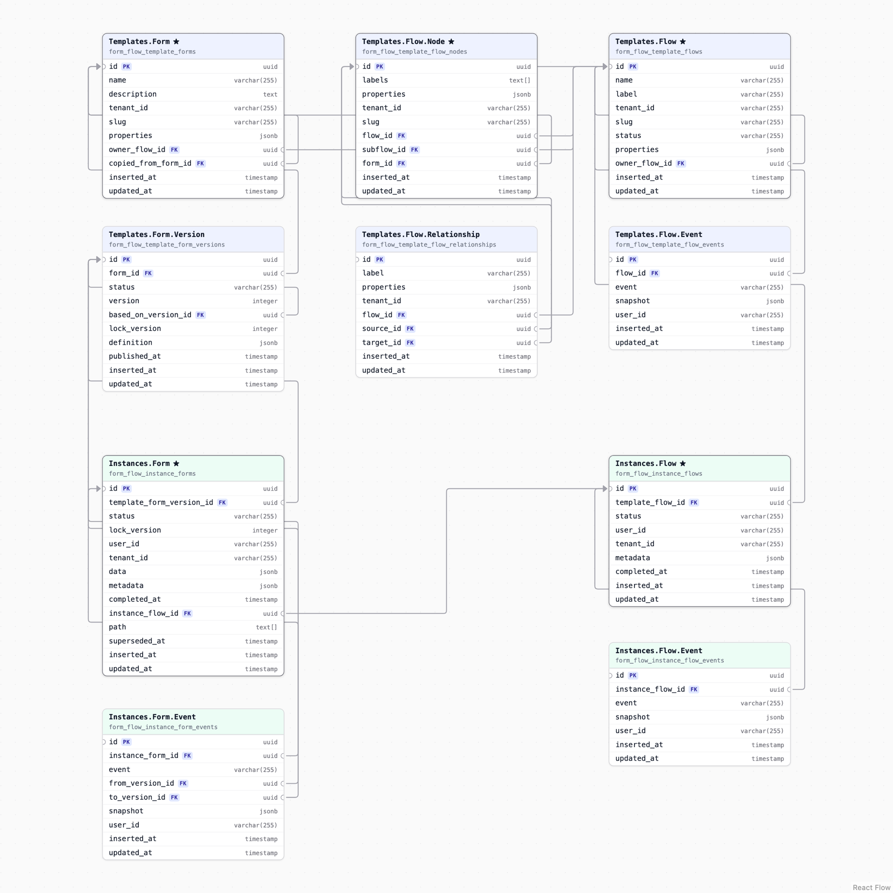
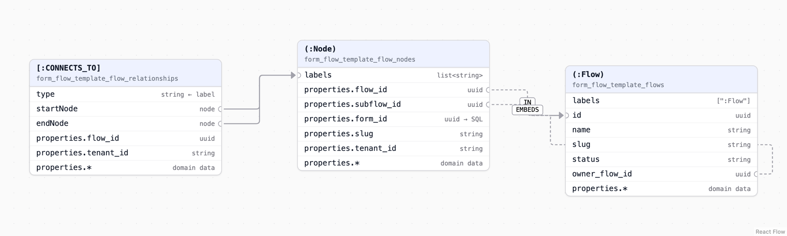

# Data modeling

> For an interactive version of this guide, see the
> [/docs/data-modeling](http://localhost:4001/docs/data-modeling) in the Demo app.

## Introduction

### The core models, Flows and Forms

There are two core data types in the library, Flows and Forms.

Imagine a user filling out three related forms for an application. Each form
the user fills out would be a `Form` and what connects the three forms
together would be a `Flow`.

Maybe you want to add a reviewer section, where a different user looks at the
forms submitted by the user and gives feedback. In that case there'd be the
original Flow that has Forms for the user, a new Flow for the Forms for the
reviewer, and a top level Flow to connect the two flows together.

We might use terms like "Root Flow" and "Subflow" and "Form Flow" to make it
easier to talk about these, but fundamentally these are modeled with just
Flows and Forms.

### Visualizing complex flows

If you visualize the more complex journeys, they begin to resemble a tree
shape — Forms are the leaf nodes and Flows are the branches and can be stacked
one on top of each other, one flow leading to another flow.

Note: to help differentiate the types we call flows that only contain forms
"Form Flows". And we call flows that only contain flows as children
"Subflows". But at the data level, they are both modeled as Flows, just with
different type fields.

### Modeling connections

We could use Form and Flow to model both the connections — how one flow
connects to another — AND the behaviour — how should a subflow render. And
it'd work, but it'd be a bit messy. The simpler way is to keep the behaviour
in the Forms and Flows, and model the connections separately.

As we've already seen, the shape of these flows becomes a kind of tree (or
graph). So a good way to model the connections is using Nodes and
Relationships (aka vertices and edges).

When modeling it this way, every Form and Flow are represented by a Node, and
the nodes are connected through Relationships.

### Templates and Instances

One more important piece of modeling terminology is the difference between
Templates and Instances.

Admin users create Templates, which define the full journey from start to end.
These contain Flow templates, Form templates, Nodes, and Relationships.

When a user goes to start a journey and fill out the first form, they create
an instance of the template.

## SQL schema

PostgreSQL and SQLite are supported. `mix form_flow.gen.migration` creates the
ten tables below.

To read the data model, recommend starting in the top right corner with
`Templates.Flow`, then move left across `Templates.Flow.Node` and
`Templates.Form`. Those are the key models on the admin template side. The
user side starts with `Instances.Flow` and moves left to `Instances.Form`.

Two schemas, shown as two colours:

| Schema | Header colour | What it holds |
|--------|---------------|---------------|
| `FormFlow.Data.Templates` | indigo | What an admin builds |
| `FormFlow.Data.Instances` | green | What a user fills out |

The five starred tables are the ones to find first; the other five support
them.



The demo draws this from FormFlow's Ecto schemas at runtime — table names,
columns in declaration order, and every `belongs_to` — so it describes the
library it is compiled against. The column types shown are the ones a
PostgreSQL host gets.

## Neo4j schema

Optional, but recommended at scale.

Modeling a flow is best done as a graph. While these can be modeled in a
traditional SQL database, it's very inefficient. Even simple flows (from a
human perspective) can take a lot of system resources to pull out of a
relational database.

To help FormFlow scale, it supports dual-writing graph data into a graph
database (Neo4j). This makes it much easier to realize a graph at scale. When
enabled, Neo4j is queried first, then a targeted SQL query is used to pull
just the data from specific IDs.



Three of the ten tables above cross over, and only those three: a node, a
relationship between two nodes, and the flow they belong to. Form templates,
form versions, and every instance table stay in SQL — a `form_id` in a Neo4j
property map is a key into Postgres, not a pointer into the graph. Flows are
drawn here as nodes rather than left out because anything a reference targets
has to be a node, or the reference cannot be traversed, and both subflow and
ownership references point at flows.

A node carries `labels`, plural — a set — while a relationship carries exactly
one `type`. FormFlow's SQL already mirrors that: `labels text[]` on the nodes
table, a single `label varchar` on the relationships table. Each entity's
`properties` column is its Neo4j property map byte for byte, which is why the
infrastructure columns are dual-written into it — in the graph there are no
columns to index.

The lines are not foreign keys. A solid one is the relationship row itself,
joining the two nodes it names. A dashed one is *structural*: a relationship
Neo4j would hold that no row does, because a property already says it.

| Reserved type | Derived from | Means |
|---------------|--------------|-------|
| `IN` | `(:Node).properties.flow_id` | the flow a node (step) belongs to |
| `EMBEDS` | `(:Node).properties.subflow_id` | the flow a node (step) embeds |
| `OWNED_BY` | `(:Flow).owner_flow_id` | the root a subflow belongs to |

Those three types are FormFlow's structural vocabulary, so user data must not
collide with them: `FormFlow.Data.Templates.Flow.Relationship` rejects them as
relationship labels today — a changeset error, not a convention — which means
no stored data will need cleaning up when the dual-write arrives.

The full mapping, and the queries it buys, are in the [Neo4j](neo4j.md) guide.

## Querying graph data

Three ways to do it, and the one FormFlow uses.

Storing a graph in a relational database is not exotic. It is two tables and a
foreign key. The interesting question is how you read it back, and there are
three well-worn answers: join your way across it, let SQL recurse for you, or
hand the job to a database built for graphs.

The examples below walk through all three using a tiny four-node graph, so the
shape of each query is easy to see. The last example is FormFlow's own, and
explains why it picks the option it does.

### Storing a graph

Storing a graph is the easy half. It is two tables and a foreign key: one
table for the things, one table for the lines between them. Every example
below runs against this.

```sql
CREATE TABLE nodes (
  id   integer PRIMARY KEY,
  name text
);

CREATE TABLE edges (
  source_id integer REFERENCES nodes (id),
  target_id integer REFERENCES nodes (id)
);

-- start --> details --> payment --> confirm
INSERT INTO nodes (id, name) VALUES
  (1, 'start'), (2, 'details'), (3, 'payment'), (4, 'confirm');

INSERT INTO edges (source_id, target_id) VALUES
  (1, 2), (2, 3), (3, 4);
```

Nothing here is special to a graph. Any database can hold one, and writing a
node or a line is a single insert.

The interesting part is reading it back. As long as you only want to filter
the graph — "which nodes are named payment?" — it stays a normal table. The
moment you want to follow it — "what comes after start, and after that?" — you
have a choice to make, and it is the same three choices every time.

### Option one: joins

Following one line is a join. Following two lines is two joins. If you know
how deep you need to go, this is all you need.

```sql
-- What comes two steps after 'start'?
SELECT third.name
  FROM nodes AS first
  JOIN edges AS e1     ON e1.source_id = first.id
  JOIN nodes AS second ON second.id = e1.target_id
  JOIN edges AS e2     ON e2.source_id = second.id
  JOIN nodes AS third  ON third.id = e2.target_id
 WHERE first.name = 'start';

-- payment
```

This is the fastest of the three options and the easiest to reason about. It
is ordinary SQL: the indexes work, the query planner understands it, and you
can add a WHERE clause anywhere.

The catch is that the depth is baked into the statement. Going three steps
means writing two more joins. And the question that has no fixed depth —
"everything reachable from start" — cannot be written this way at all, because
you do not know how many joins to write until you have already looked.

That is the whole trade. Joins are the right tool when the depth is part of
the question, and no help when it isn't.

### Option two: a recursive CTE

A recursive common table expression is SQL's answer to unknown depth. A query
that refers to itself: start somewhere, then keep joining the results back
onto the edges until nothing new comes back.

```sql
-- Everything reachable from 'start', however deep.
-- Both PostgreSQL and SQLite support this.
WITH RECURSIVE reachable AS (
  -- Where to start
  SELECT id, name, 0 AS depth
    FROM nodes
   WHERE name = 'start'

  UNION ALL

  -- One more step out, applied to whatever the last step found
  SELECT n.id, n.name, r.depth + 1
    FROM reachable AS r
    JOIN edges AS e ON e.source_id = r.id
    JOIN nodes AS n ON n.id = e.target_id
   WHERE r.depth < 10
)
SELECT * FROM reachable;
```

One statement, any depth, one round trip to the database. This is the standard
answer, and for most graph questions in SQL it is the right one.

What you give up is control. The traversal is opaque: the planner walks
whatever you told it to walk, and filtering part way down means putting the
condition inside the recursive half of the query, where it is easy to get
subtly wrong.

Then there is that depth cap, which is doing a job it is not really qualified
for. SQL has no memory of where it has been, so an edge that points back to an
earlier node loops until the cap stops it — and a cap cannot tell a cycle
apart from a graph that is honestly ten levels deep. There are better guards
(an array of visited ids, or PostgreSQL's CYCLE clause), but they are more
machinery, and the SQLite version is different from the PostgreSQL one.

### Option three: a graph database

The third option is to stop asking SQL. In a graph database, following lines
is the primary operation rather than something assembled out of joins, and it
shows in how the question is written.

```cypher
// The same question in Cypher, Neo4j's query language.
// The '*' is the part SQL has no syntax for: follow this kind of
// line any number of times.
MATCH (start:Step {name: 'start'})-[:CONNECTS_TO*]->(reachable:Step)
RETURN reachable;
```

Depth is a symbol in the pattern instead of a shape in the statement, cycles
are handled by the engine, and a traversal costs roughly what it should: the
engine hops from node to node rather than matching rows against an index each
time. For a large or deep graph the difference is not small.

The cost is operational, not syntactic. It is a second database. It has to be
running, something has to write to both, and the two have to agree. And the
rest of your data is still in SQL, so a graph query usually answers with a
list of ids that you then go and look up in SQL anyway.

That last point is worth sitting with, because it is what makes the
combination workable: you do not have to move everything. Keep the graph in
the graph database, keep the records in SQL, and let each answer the questions
it is good at.

### What FormFlow does

FormFlow takes option one, pushed as far as it goes: no joins and no recursion
in SQL at all. Reading one level of the graph is two indexed lookups on the
same key, and the traversal happens in Elixir.

```sql
-- One flow's nodes and lines. Two lookups on the same index, no join
-- between them — the caller wants both lists whole.
SELECT * FROM form_flow_template_flow_nodes         WHERE flow_id = '3f2c...';
SELECT * FROM form_flow_template_flow_relationships WHERE flow_id = '3f2c...';
```

That pair is what `FormFlow.Data.Templates.Flows.get/1` issues. When a node
embeds a subflow, `FormFlow.Data.Templates.Flows.resolve_tree/1` runs the pair
again for that flow, carrying a set of the flow ids it has already visited,
and assembles the tree as it goes.

This works because of the size and shape of the data. A flow is tens of rows,
not thousands, and templates are one or two levels deep in practice, so the
extra round trips are cheap. In exchange you get an exact cycle guard instead
of a depth cap — a flow that embeds one of its own ancestors resolves to
nothing, while the same flow embedded twice side by side is correctly resolved
at both positions, a distinction a depth cap cannot draw.

The limit is honest enough: the round trips grow with the number of flows in
the tree. A template with many subflows nested many levels deep is where this
shape gets slow, and no amount of SQL tuning fixes it, because the recursion
is not in the SQL.

That is what the Neo4j mapping above is for. The day flows get big enough for
it to matter, "everything reachable from here, filtered, in one hop" is a
question to hand to option three.

## SQL data relationships

### Delete types

| Rule | Meaning |
|------|---------|
| `ON DELETE CASCADE` | deleting the referenced row deletes this one with it |
| `ON DELETE RESTRICT` | the database refuses to delete the referenced row while this one points at it |
| `ON DELETE SET NULL` | deleting the referenced row leaves this column NULL |
| `ON DELETE NO ACTION` | the database allows it; FormFlow refuses in application code instead, where it can say why and control the ordering |

### Foreign keys

| Column | References | On delete |
|--------|------------|-----------|
| `form_flow_template_flows.owner_flow_id` | `form_flow_template_flows.id` | `CASCADE` |
| `form_flow_template_forms.owner_flow_id` | `form_flow_template_flows.id` | `SET NULL` |
| `form_flow_template_forms.copied_from_form_id` | `form_flow_template_forms.id` | `SET NULL` |
| `form_flow_template_flow_nodes.flow_id` | `form_flow_template_flows.id` | `CASCADE` |
| `form_flow_template_flow_nodes.subflow_id` | `form_flow_template_flows.id` | `NO ACTION` |
| `form_flow_template_flow_nodes.form_id` | `form_flow_template_forms.id` | `NO ACTION` |
| `form_flow_template_flow_relationships.flow_id` | `form_flow_template_flows.id` | `CASCADE` |
| `form_flow_template_flow_relationships.source_id` | `form_flow_template_flow_nodes.id` | `CASCADE` |
| `form_flow_template_flow_relationships.target_id` | `form_flow_template_flow_nodes.id` | `CASCADE` |
| `form_flow_template_flow_events.flow_id` | `form_flow_template_flows.id` | `RESTRICT` |
| `form_flow_template_form_versions.form_id` | `form_flow_template_forms.id` | `RESTRICT` |
| `form_flow_template_form_versions.based_on_version_id` | `form_flow_template_form_versions.id` | `SET NULL` |
| `form_flow_instance_flows.template_flow_id` | `form_flow_template_flows.id` | `RESTRICT` |
| `form_flow_instance_forms.template_form_version_id` | `form_flow_template_form_versions.id` | `RESTRICT` |
| `form_flow_instance_forms.instance_flow_id` | `form_flow_instance_flows.id` | `RESTRICT` |
| `form_flow_instance_form_events.instance_form_id` | `form_flow_instance_forms.id` | `RESTRICT` |
| `form_flow_instance_form_events.from_version_id` | `form_flow_template_form_versions.id` | `RESTRICT` |
| `form_flow_instance_form_events.to_version_id` | `form_flow_template_form_versions.id` | `RESTRICT` |
| `form_flow_instance_flow_events.instance_flow_id` | `form_flow_instance_flows.id` | `RESTRICT` |
